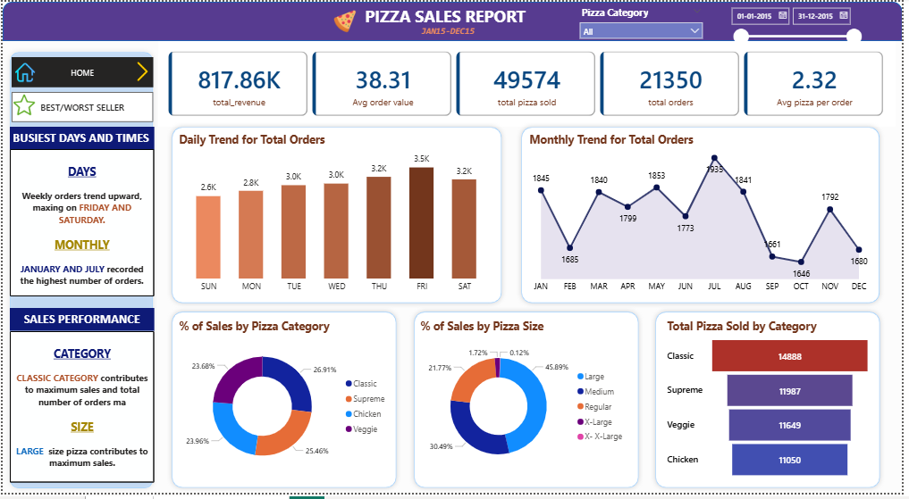

# 🍕 Pizza Sales Analytics Dashboard

An end-to-end data analytics project — from raw CSV to an interactive Power BI dashboard — built to surface actionable business insights for a pizza restaurant.

## 📊 Dashboard Preview


---
---

## 📌 Project Overview

This project simulates a real-world business intelligence workflow:

1. **Raw Data** → Ingested a transactional CSV dataset of pizza sales
2. **Data Cleaning** → Handled nulls, standardized formats, validated data types
3. **SQL Analysis** → Wrote custom queries in MySQL to compute KPIs and verify results
4. **Dashboard** → Built an interactive Power BI report with DAX measures, slicers, and page navigation

The goal wasn't just to visualize data — it was to answer questions a restaurant owner or operations manager would actually ask.

---

## 📊 Key KPIs

| Metric | Value |
|--------|-------|
| Total Revenue | $817,860.05 |
| Total Orders | 21,350 |
| Total Pizzas Sold | 49,574 |
| Average Order Value | $38.31 |
| Avg Pizzas per Order | 2.32 |

---

## 🔍 Business Insights

- **Fridays** drive peak order volume (3,538 orders); **Sundays** are the slowest (2,624) — clear staffing and promotion implications
- **Large size** dominates revenue at ~46% — sizing strategy is a key lever
- **Classic** category leads with 26.9% revenue share, but all four categories are within 3.3% of each other — healthy menu balance
- **Thai Chicken Pizza** is the top revenue earner ($43,434); **Brie Carre Pizza** is both lowest revenue AND lowest order count — prime candidate for menu review
- Orders peak in **July** and dip from **October–December** — a seasonal promotions opportunity

---

## 🛠 Tools & Tech Stack

- **MySQL** — Data querying, KPI validation, aggregations
- **Power BI** — Dashboard design, DAX measures, slicers, page navigation
- **Excel / CSV** — Initial data inspection and cleaning

---

## 📁 Repository Structure

```
pizza-sales-dashboard/
│
├── data/
│   └── pizza_sales.csv          # Raw dataset
│
├── sql/
│   └── pizza_sales_queries.sql  # All SQL queries used for analysis
│
├── dashboard/
│   └── pizza_sales.pbix         # Power BI dashboard file
│
└── README.md
```

---

## 💡 Why This Project

As a pre-MBA student, I'm interested in how data translates into business strategy. This project was an exercise in thinking like an operator — not just building charts, but asking *what decision does this inform?*

Every KPI in this dashboard has a business question behind it.

---

## 📬 Connect

Feel free to reach out on [www.linkedin.com/in/brajendra-verma-analyst](#) if you want to discuss the project or the methodology.
